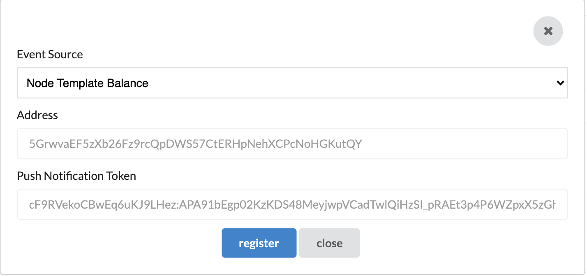
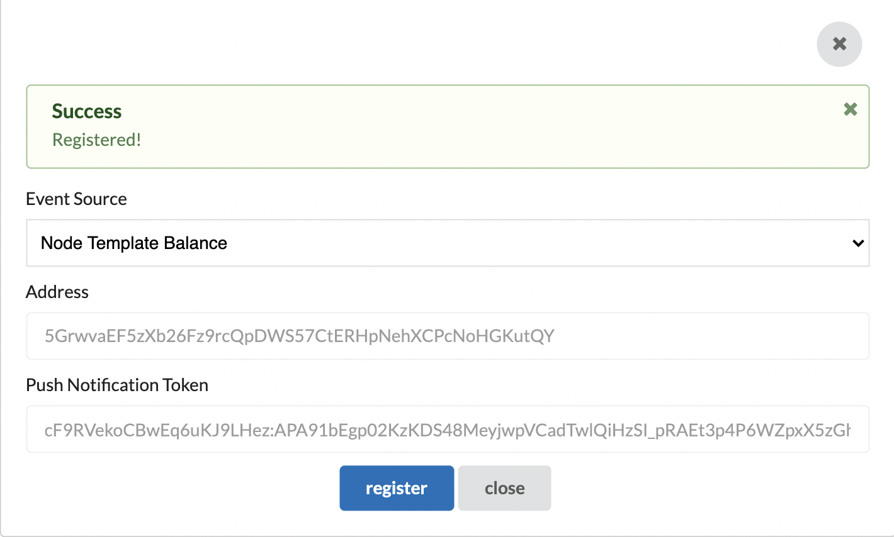
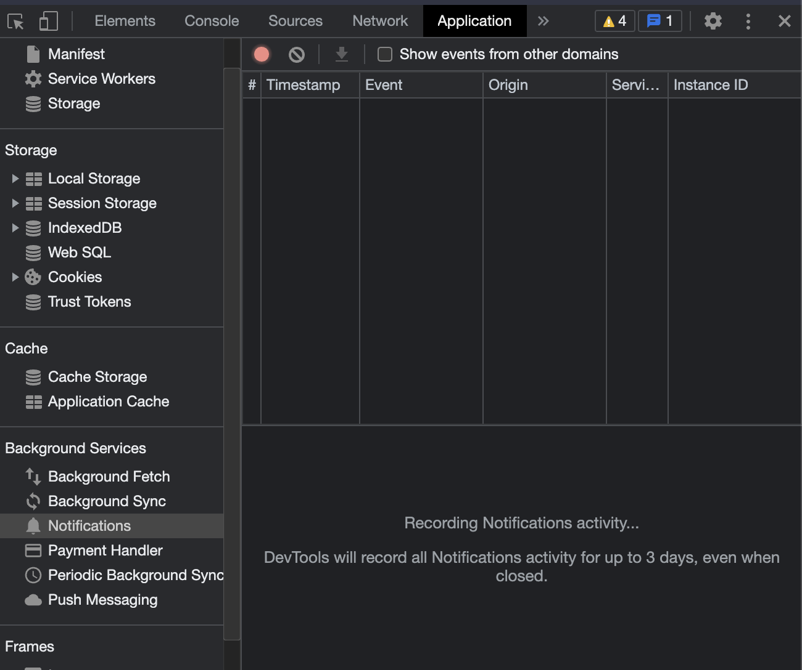
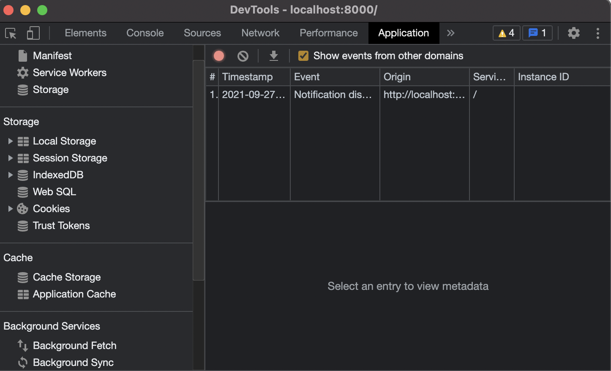

# Integration test

## Steps
1. While the Aurras system is up and running
2. Make sure [wsk cli](https://github.com/apache/openwhisk-cli) is added to the path
3. Install the [actions](../../../#installation)
4. Register event source using the below command with name as param eg: --name polkadot-balance if connecting to polkadot

```
./register_event_source.sh --name polkadot-balance
```
5. Get the generated uuid and add as an environment variable to the substrate [event feed](../../../../?q=aurras-event-feed)
6. Connect event feed with a Substrate based chain
7. Navigate to examples/susbtrate-push-notification
8. Add [API configuration](../../../examples/substrate-push-notification#api-configuration) and [Firebase Push Notification Configuration](../../../examples/substrate-push-notification#push-notification-configuration)
9. Install Node Dependencies using `yarn install`
10. Start susbtrate-push-notification using `yarn start`
> For Brave brower enable `Use Google services for push messaging` using brave://settings/privacy
11. Upon Notification Permission Prompt Click Allow

12. Select the account for which balance notification to be received 
13. Click Register Balance Notification button
14. Select the Event Source 

15. Click Register

16. Perform an amount transfer transaction to the registered wallet.
> Make sure substrate-push-notification app is not in foreground
17. Verify the push notification received.


